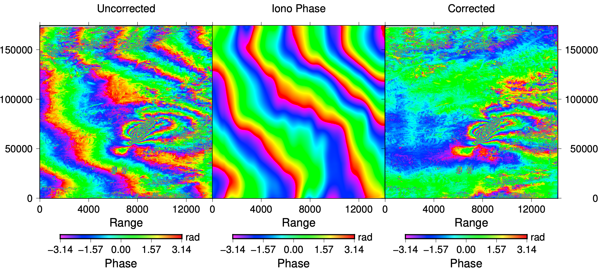
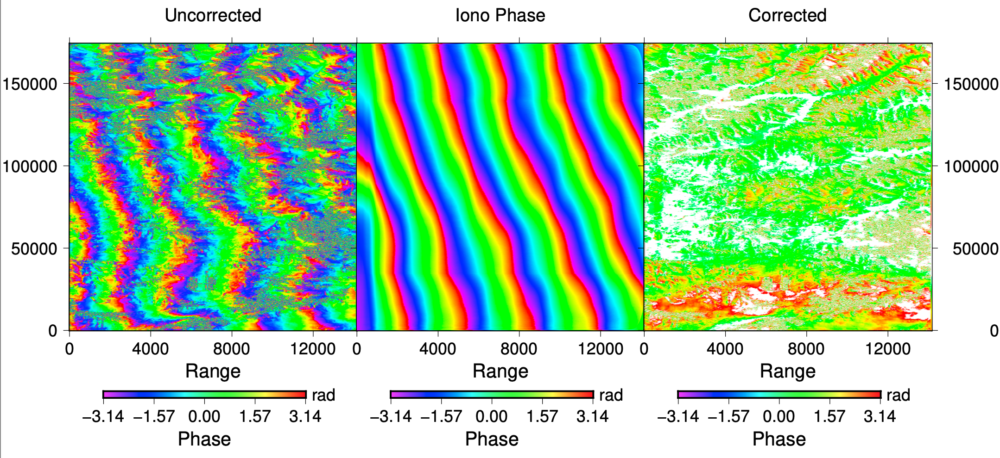

# ionospheric_correction

We use the split-spectrum method (Gomba etal., 2015; Heresh et al., 2017) to correct ionospheric noise

$$ \Delta \hat{\phi}_{iono} = \frac{f_L f_H}{f_0 (f^2_H - f^2_L)}(\Delta \phi_L f_H - \Delta \phi_H f_L) $$

Because ALOS-2 data has a narrow bandwidth $(f_H - f_L)$ compared to its central frequency $f_0$, 
for instance, $f_0 = 1.24$ GHz, but the bandwith is 4 MHz, the correction formula would amplify the noise in the interferogram.

To solve this issue, not only do we need a large filter, but also rule out pixels whose amplitude is too large after the correction.

The command to correct ionospheric noise:
```
cd iono_correction

estimate_ionospheric_phase_local.csh  ../../intf_h/20160518_20161019  ../../intf_l/20160518_20161019  
../../intf_o/20160518_20161019  ../../20160518_20161019  0.82  7.5
```
The last two parameters denote the filter wavelength ratio along range and azimuth directions.

Sometimes, the corrected phase is centralized at $\pi$ values. Since the absolute phase value is not needed, we can shift $\pi$ values of corrected phase to let it be centralized at 0.
```
gmt grdmath ph_corrected.grd PI ADD 2 PI MUL MOD = ph_corrected.grd
```

Plot the comparison between original and corrected interferogram:
```
plot_iono.csh  20160518_20161019
```
It generates a figure named with "iono_correct.pdf" located in each directory.

Correction of coseismic interferogram
<p align="center">
  
</p>

Correction of postseismic interferogram
<p align="center">
  
</p>

Compared to traditional methods, we have some improvements/adjustments:
1. The traditional correction methods works only on single subswath. If we merge 3/5 subswaths for the whole interferogram, due to a amplifier in the split-spectrum formula, there may exist a very large discontinuity between each subswath. We need to remove the discontinuity using the file "boundary.txt" that gives the # of range pixels at each intersection of subswath. (**correct_subswath_local.m**)

2. We also need to remove noisy pixels by setting the amplitude threshold in **correct_subswath_local.m**. In this example, I set the threshold to be 220. In other real cases, it's better to write a program that chops off 5% ~ 10% pixels using its amplitude distribution.

3. During the iterative interpolation & filtering step, we use linear extrapolation instead of nearest interpolation methods that proposed in Heresh etal., 2017. Because the phase is **NOT randomly distributed within an area**, instead, it's somewhat linearly extended to the whole space of the interferogram. **The nearest extrapolation would under-estimate the ionospheric signal**.

4. Previous **grdfilter** uses a rectangular filter which is not good to filter irregular shape of ionospheric patterns. Instead, we design a non-isotropic filter shape (**nancov.m**). This filter could also reduce the edge effects in the interferogram during the filtering step.
